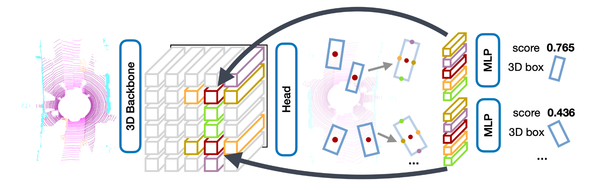

# Apollo CenterPoint

该项目提供了开源自动驾驶平台Apollo中Lidar 3D目标检测算法CenterPoint的训练和部署代码。
## 介绍

CenterPoint是Anchor-Free的三维物体检测器，以点云作为输入，将三维物体在Bird-View下的中心点作为关键点，基于关键点检测的方式回归物体的尺寸、方向和速度。相比于Anchor-Based的三维物体检测器，CenterPoint不需要人为设定Anchor尺寸，面向物体尺寸多样不一的场景时其精度表现更高，且简易的模型设计使其在性能上也表现更加高效。

<div align=center>

</div>

Apollo对CenterPoint进行了一系列优化工作，检测效果和泛化能力都获得大幅提升，可以提供复杂城市道路场景下实时、准确、稳定的3D目标检测效果。

模型端：
* **更好的检测效果，更强的泛化能力**。使用百万真实路测数据对CenterPoint进行训练和优化，精度和召回率相较于应用最多的CNNSeg模型提升了20%+，检测能力和泛化能力显著提升。
* **新增城市道路标识检测能力**。提供了锥桶、水马、防撞桶、指示牌等目标的检测能力，极大地保障了自动驾驶的安全性。
* **降低训练开发成本，提升易用性**。代码中新增功能：冻结网络层finetune训练、fp16训练、自定义数据集训练评测等功能，更加简单易上手。

部署端：
* **显著提升近处行人目标和小目标的召回率**。对前后处理、配置、模型推理进行了针对性调优和处理，修复了推理端结果不一致问题，行人和小目标召回率提升。
* **输出polygon，增强跟踪稳定性**。优化了障碍物点云的获取逻辑，使centerpoint可输出准确polygon信息，进一步增强了跟踪的稳定性。
* **大幅降低模型推理耗时和GPU占用**。提供了tensorrt + fp16推理 & int8推理的功能和教程，在保持模型检测效果前提下，大幅降低了模型的推理耗时和GPU占用，在低算力平台运行可满足实时性要求。

检测结果可视化

<div align=center>

</div>

<div align=center>

</div>

模型文件下载地址

| 模型文件 | 下载地址 |
| -- | -- |
| Apollo CenterPoint训练权重文件 | [Link](https://apollo-pkg-beta.bj.bcebos.com/perception_model/centerpoint_core_pretrained_model.zip) |
| Apollo CenterPoint可部署文件 | [Link](https://apollo-pkg-beta.bj.bcebos.com/perception_model/center_point_paddle.zip) |

## 开发

开发者可基于该代码进行二次开发，快速方便地完成：
* **学习研究**：使用公开数据集KITTI和NuScenes对CenterPoint进行训练、评测、导出、部署。
* **增量训练**：使用自定义数据集对CenterPoint进行增量训练，提升在用户自定义场景中的检测效果。
* **Apollo感知赛事**：使用Apolloscape数据集对CenterPoint进行训练，顺利完成Apollo感知赛事。

环境配置和安装教程详尽[installation](./docs/installation.md)

完整训练流程和配置详见 [centerpoint](./configs/centerpoint/)，下面以KITTI数据集为例进行简单介绍。

先准备KITTI数据集，请在[官网](http://www.cvlibs.net/datasets/kitti/eval_object.php?obj_benchmark=3d)进行下载。将数据解压后按照下方的目录结构进行组织：

```
kitti_dataset_root
|—— training
|   |—— label_2
|   |   |—— 000001.txt
|   |   |—— ...
|   |—— calib
|   |   |—— 000001.txt
|   |   |—— ...
|   |—— velodyne
|   |   |—— 000001.bin
|   |   |—— ...
|—— ImageSets
│   |—— test.txt
│   |—— train.txt
│   |—— trainval.txt
│   |—— val.txt
```

在Paddle3D的目录下创建软链接 `datasets/KITTI`，指向到上面的数据集目录:

```
mkdir datasets
ln -s /path/to/kitti_dataset_root ./datasets
mv ./datasets/kitti_dataset_root ./datasets/KITTI
```

生成训练时数据增强所需的真值库:

```
python tools/create_det_gt_database.py --dataset_name kitti --dataset_root ./datasets/KITTI --save_dir ./datasets/KITTI
```

```
kitti_train_gt_database
|—— anno_info_train.pkl
|—— Car
|   |—— 4371_Car_7.bin
|   |—— ...
|—— Cyclist
```

使用8张GPU训练KITTI数据集：

```
python -m paddle.distributed.launch --gpus 0,1,2,3,4,5,6,7 tools/train.py --config configs/centerpoint/centerpoint_pillars_016voxel_kitti.yml --save_dir ./output_kitti --num_workers 4 --save_interval 5
```
模型评测

```
python tools/evaluate.py --config configs/centerpoint/centerpoint_pillars_016voxel_kitti.yml --model ./output_kitti/epoch_160/model.pdparams --batch_size 1 --num_workers 4
```
导出推理模型，将训练时保存的动态图模型文件导出成推理引擎能够加载的静态图模型文件。

```
python tools/export.py --config configs/centerpoint/centerpoint_pillars_02voxel_nuscenes_10sweep.yml --model /path/to/model.pdparams --save_dir /path/to/output
```

## 其他资料

* [Apollo自动驾驶平台](https://github.com/ApolloAuto/apollo)
* [2023星火培训感知专项营：感知模型训练与部署](https://www.bilibili.com/video/BV1RV411c7Xp/)
* [CenterPoint模型训练与部署](https://apollo.baidu.com/community/article/1141)

# Paddle3D
## 🌈简介

Paddle3D是飞桨官方开源的端到端深度学习3D感知套件，涵盖了许多前沿和经典的3D感知模型，支持多种模态和多种任务，可以助力开发者便捷地完成 **『自动驾驶』** 领域模型 从训练到部署的全流程应用。

<div align="center">
<p align="center">
  
</p>
</div>

<div align="center">
<p align="center">
  
</p>
</div>

## ✨主要特性

### 🧩灵活的框架设计

针对各类3D数据格式，灵活构建数据处理、骨干网络等核心模块，支持基于[PaddleDetection](https://github.com/PaddlePaddle/PaddleDetection)、[PaddleSeg](https://github.com/PaddlePaddle/PaddleSeg)灵活扩展2D视觉感知能力，并提供API与脚本两种训练评估方式，满足开发者灵活定制的差异化需求。

### 📱丰富的模型库

聚合主流3D感知算法及精度调优策略，覆盖单目、点云等多种模态及检测、分割等多种任务类型。


### 🎗️端到端全流程

支持KITTI、nuScenes、Waymo等主流3D数据集，提供从数据处理、模型搭建、训练调优到部署落地的全流程能力，极致优化模型性能，适配多种自动驾驶主流芯片，支持计算图优化、TensorRT/OpenVINO等加速库，并提供了开箱即用的部署教程，5分钟即可完成模型部署。

### 🏆无缝衔接Apollo

无缝对接Apollo自动驾驶平台，支持真机与仿真平台实验效果快速验证、多模态模型高性能融合，实现自动驾驶全栈式技术方案的高效搭建。

<div align="center">
<p align="center">
  
</p>
</div>

## 📣最新进展

**💎稳定版本**

位于[`主分支`](https://github.com/PaddlePaddle/Paddle3D)，Paddle3D v1.0正式版本发布，详情请参考[release note](https://github.com/PaddlePaddle/Paddle3D/releases/tag/v1.0)。

**🧬预览版本**

位于[`develop`](https://github.com/PaddlePaddle/Paddle3D/tree/develop)分支，体验最新功能请切换到[该分支](https://github.com/PaddlePaddle/Paddle3D/tree/develop)。
## 👫开源社区

- **📑项目合作：** 如果您是企业开发者且有明确的目标检测垂类应用需求，请扫描如下二维码入群，并联系`群管理员AI`后可免费与官方团队展开不同层次的合作。
- **🏅️社区贡献：** Paddle3D非常欢迎你加入到飞桨社区的开源建设中，参与贡献方式可以参考[开源项目开发指南](https://www.paddlepaddle.org.cn/documentation/docs/zh/dev_guides/index_cn.html)。
- **💻直播教程：** Paddle3D会定期在飞桨直播间([B站:飞桨PaddlePaddle](https://space.bilibili.com/476867757)、[微信: 飞桨PaddlePaddle](https://mp.weixin.qq.com/s/6ji89VKqoXDY6SSGkxS8NQ))，针对发新内容、以及产业范例、使用教程等进行直播分享。

<div align="center">

<p>Paddle3D官方技术交流群二维码</p>
</div>

- **🎈社区近期活动**

  - **🎗️Paddle3D v1.0正式版解读**
    - `文章传送门`：[Paddle3D正式版发布！BEV、单目、激光雷达3D感知算法开箱即用，无缝衔接Apollo](https://mp.weixin.qq.com/s/LL0DgKxEVsfhpFO6HedQ7Q)

    <div align="center">
    
    <p></p>
    </div>

  - **🚦自动驾驶感知系统揭秘**
    - `课程录播&PPT传送门`：[自动驾驶感知系统揭秘](https://aistudio.baidu.com/aistudio/education/group/info/26961)

    <div align="center">
    
    <p></p>
    </div>


### 📱模型库

<table align="center">
  <tbody>
    <tr align="center" valign="center">
      <td>
        <b>单目3D感知</b>
      </td>
      <td>
        <b>激光雷达3D感知</b>
      </td>
      <td>
        <b>多相机3D感知</b>
      </td>
      <td>
        <b>骨干网络</b>
      </td>
    </tr>
    <tr valign="top">
      <td>
            </ul>
          <li><b>检测</b></li>
        <ul>
      <ul>
          <li><a href="docs/models/caddn">CaDDN</a></li>
          <li><a href="docs/models/smoke">SMOKE</a></li>
          <li><a href="docs/models/dd3d">DD3D</a></li>
      </ul>
      </td>
      <td>
      </ul>
          <li><b>检测</b></li>
        <ul>
        <ul>
           <li><a href="docs/models/pointpillars">PointPillars</a></li>
            <li><a href="docs/models/centerpoint">CenterPoint</a></li>
            <li><a href="docs/models/iassd">IA-SSD</a></li>
            <li><a href="docs/models/pv_rcnn">PV-RCNN</a></li>
            <li><a href="docs/models/voxel_rcnn">Voxel-RCNN</a></li>
            <li><a href="docs/models/paconv">PAConv</a></li>
            </ul>
            </ul>
          <li><b>分割</b></li>
        <ul>
        <ul>
            <li><a href="docs/models/squeezesegv3">SqueezeSegV3</a></li>
        </ul>
      </td>
      <td>
        </ul>
          <li><b>BEV-Camera</b></li>
        <ul>
        <ul>
          <li><a href="docs/models/petr">PETR</a></li>
          <li><a href="docs/models/petr">PETRv2</a></li>
          <li><a href="docs/models/bevformer">BEVFormer</a></li>
        </ul>
      </td>
      <td>
        <ul>
            <li><a href="paddle3d/models/backbones">DLA</a></li>
            <li><a href="paddle3d/models/backbones">HRNet</a></li>
            <li><a href="paddle3d/models/backbones">ResNet</a></li>
            <li><a href="paddle3d/models/backbones">Transformer</a></li>
        </ul>
      </td>
    </tr>
</td>
    </tr>
  </tbody>
</table>

## 🔥使用教程

* [安装](./docs/installation.md)

* [全流程速览](./docs/quickstart.md)

* [自定义数据准备](./docs/datasets/custom.md)

* [配置文件详解](./docs/configuration.md)

* [API](./docs/api.md)

* Paddle3D&Apollo集成开发示例
  * [视觉感知算法集成开发示例](https://apollo.baidu.com/community/Apollo-Homepage-Document/Apollo_Doc_CN_8_0/camera)
  * [点云感知算法集成开发示例](https://apollo.baidu.com/community/Apollo-Homepage-Document/Apollo_Doc_CN_8_0/lidar)

* [常见问题](./docs/faq.md)

* [更新日志](./docs/release_note.md)

## 💡产业实践范例

产业实践范例是Paddle3D针对3D目标检测应用场景，提供的端到端开发示例，帮助开发者打通数据标注-模型训练-模型调优-预测部署全流程。
针对每个范例我们都通过[AI-Studio](https://ai.baidu.com/ai-doc/AISTUDIO/Tk39ty6ho)提供了项目代码以及说明，用户可以同步运行体验。

- [【自动驾驶实战】基于Paddle3D&Apollo的点云3D目标物检测](https://aistudio.baidu.com/aistudio/projectdetail/5268894)
- [【自动驾驶实战】基于Paddle3D&Apollo的单目3D目标物检测](https://aistudio.baidu.com/aistudio/projectdetail/5269115)

## 📝许可证

本项目的发布受[Apache 2.0 license](./LICENSE)许可认证。
