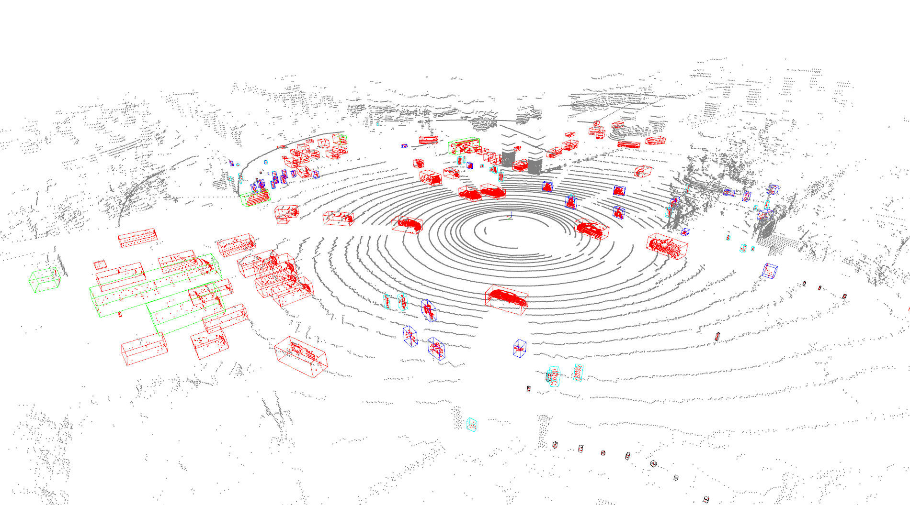
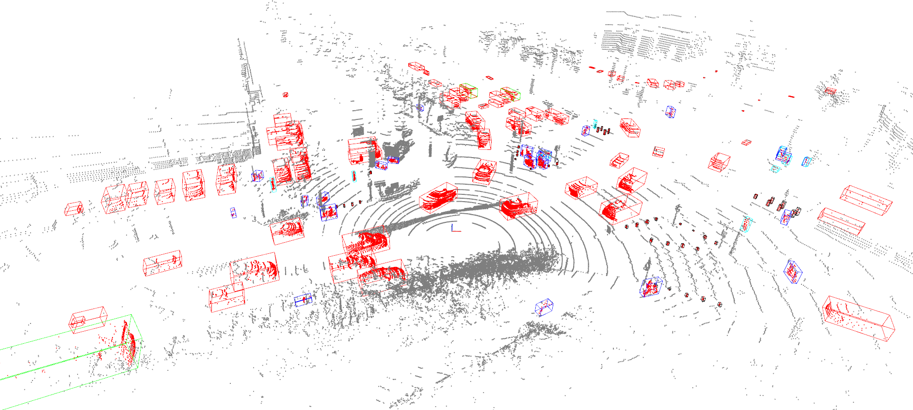
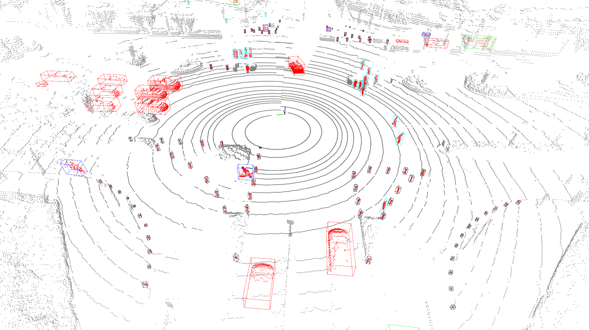

# CenterPoint：Center-based 3D Object Detection and Tracking
## 目录
* [引用](#1)
* [简介](#2)
* [模型库](#3)
* [训练 & 评估](#4)
  * [nuScenes数据集](#41)
  * [KITTI数据集](#42)
* [导出 & 部署](#8)
* [Apollo模型](#9)
* [训练自定义数据集](#10)

## <h2 id="1">引用</h2>

> Yin, Tianwei and Zhou, Xingyi and Krahenbuhl, Philipp. "Center-Based 3D Object Detection and Tracking." In Proceedings of the IEEE/CVF Conference on Computer Vision and Pattern Recognition (CVPR), pp. 11784-11793. 2021.

## <h2 id="2">简介</h2>

CenterPoint是Anchor-Free的三维物体检测器，以点云作为输入，将三维物体在Bird-View下的中心点作为关键点，基于关键点检测的方式回归物体的尺寸、方向和速度。相比于Anchor-Based的三维物体检测器，CenterPoint不需要人为设定Anchor尺寸，面向物体尺寸多样不一的场景时其精度表现更高，且简易的模型设计使其在性能上也表现更加高效。

Paddle3D实现的CenterPoint做了以下优化：
- 对模型的前后处理做了性能优化。CenterPoint-Pillars在[nuScenes](https://www.nuscenes.org/nuscenes) val set上精度有50.97mAP，速度在Tesla V100上达到了50.28FPS。
- 提供[KITTI数据集](http://www.cvlibs.net/datasets/kitti/eval_object.php?obj_benchmark=3d)上的训练配置和Baseline。CenterPoint-Pillars在KITTI val set上精度达到64.75 mAP，速度在Tesla V100上达到了43.96FPS。

跟原论文相比，Paddle3D实现的CenterPoint有以下差异：
- 未提供第二个阶段的实现。在原论文中，作者还设计了第二个阶段来进一步精炼物体的位置、尺寸和方向，并在[Waymo数据集](https://waymo.com/open/)上做了验证。Paddle3D目前还未适配Waymo数据集，所以第二个阶段暂未实现。
- 未提供在nuScenes数据集上将预测速度用于多目标跟踪的实现。

## <h2 id="3">模型库</h2>

- CenterPoint在nuScenes Val set数据集上的表现

| 模型 | 体素格式 | mAP | NDS | V100 TensorRT FP32(FPS) | V100 TensorRT FP16(FPS) | 模型下载 | 配置文件 | 日志 |
| ---- | ---------------- | --- | --- | ----------------------- | ----------------------- | -------- | -------- | ---- |
| CenterPoint | 2D-Pillars | 50.97 | 61.30 | 50.28 | 63.43 | [model](https://bj.bcebos.com/paddle3d/models/centerpoint//centerpoint_pillars_02voxel_nuscenes_10sweep/model.pdparams) | [config](../../../configs/centerpoint/centerpoint_pillars_02voxel_nuscenes_10sweep.yml) | [log](https://bj.bcebos.com/paddle3d/models/centerpoint//centerpoint_pillars_02voxel_nuscenes_10sweep/train.log) \| [vdl](https://paddlepaddle.org.cn/paddle/visualdl/service/app?id=f150eb3b4db30c7bd4ff2dfac5ca4166) |
| CenterPoint | 3D-Voxels | 59.25 | 66.74 | 21.90 | 26.93 | [model]( https://bj.bcebos.com/paddle3d/models/centerpoint/centerpoint_voxels_0075voxel_nuscenes_10sweep/model.pdparams) | [config](../../../configs/centerpoint/centerpoint_voxels_0075voxel_nuscenes_10sweep.yml) | [log]( https://bj.bcebos.com/paddle3d/models/centerpoint/centerpoint_voxels_0075voxel_nuscenes_10sweep/train.log) \| [vdl](https://paddlepaddle.org.cn/paddle/visualdl/service/app?id=2cf9f2123ea8393cf873e8f8ae907fdc) |

**注意：nuScenes benchmark使用4张V100 GPU训练得出。3D Sparse Conv功能需要安装Paddle 2.4版。**

- CenterPoint在KITTI Val set数据集上的表现

| 模型 | 体素格式 | 3DmAP Mod. | Car<br>Easy Mod. Hard | Pedestrian<br>Easy Mod. Hard | Cyclist<br>Easy Mod. Hard | V100 TensorRT FP32(FPS) | V100 TensorRT FP16(FPS) | 模型下载 | 配置文件 |  日志 |
| ---- | ---------------- | ---------- | ------------------ | ------------------------- | -----------------------| ----------------------- | ----------------------- | -------- | -------- | ---- |
| CenterPoint | 2D-Pillars | 64.75 | 85.99 76.69 73.62 | 57.66 54.03 49.75 | 84.30 63.52 59.47 | 43.96 | 74.21 | [model]( https://bj.bcebos.com/paddle3d/models/centerpoint//centerpoint_pillars_016voxel_kitti/model.pdparams) | [config](../../../configs/centerpoint/centerpoint_pillars_016voxel_kitti.yml)| [log]( https://bj.bcebos.com/paddle3d/models/centerpoint//centerpoint_pillars_016voxel_kitti/train.log) \| [vdl](https://paddlepaddle.org.cn/paddle/visualdl/service/app?id=7f2b637cfce7995a55b915216b8b1171) |

| 模型 | 体素格式 | BEVmAP Mod. | Car<br>Easy Mod. Hard | Pedestrian<br>Easy Mod. Hard | Cyclist<br>Easy Mod. Hard | V100 TensorRT FP32(FPS) | V100 TensorRT FP16(FPS) | 模型下载 | 配置文件 |  日志 |
| ---- | ---------------- | ----------- | ------------------ | ------------------------- | ---------------------- | ----------------------- | ----------------------- | -------- | -------- | ---- |
| CenterPoint | 2D-Pillars | 71.87 | 93.03 87.33 86.21 | 66.46 62.66 58.54 | 86.59 65.62 61.58 | 43.96 | 74.21 | [model]( https://bj.bcebos.com/paddle3d/models/centerpoint//centerpoint_pillars_016voxel_kitti/model.pdparams) | [config](../../../configs/centerpoint/centerpoint_pillars_016voxel_kitti.yml)| [log]( https://bj.bcebos.com/paddle3d/models/centerpoint//centerpoint_pillars_016voxel_kitti/train.log) \| [vdl](https://paddlepaddle.org.cn/paddle/visualdl/service/app?id=7f2b637cfce7995a55b915216b8b1171) |

**注意：** KITTI benchmark使用8张V100 GPU训练得出。

## <h2 id="4">训练 & 评估</h2>

### <h3 id="41">nuScenes数据集</h3>
#### 数据准备

- 目前Paddle3D中提供的CenterPoint模型支持在nuScenes数据集上训练，因此需要先准备nuScenes数据集，请在[官网](https://www.nuscenes.org/nuscenes)进行下载，并将数据集目录准备如下：

```
nuscenes_dataset_root
|—— samples  
|—— sweeps  
|—— maps  
|—— v1.0-trainval  
```

在Paddle3D的目录下创建软链接 `datasets/nuscenes`，指向到上面的数据集目录:

```
mkdir datasets
ln -s /path/to/nuscenes_dataset_root ./datasets
mv ./datasets/nuscenes_dataset_root ./datasets/nuscenes
```

- 生成训练时数据增强所需的真值库:

```
python tools/create_det_gt_database.py --dataset_name nuscenes --dataset_root ./datasets/nuscenes --save_dir ./datasets/nuscenes
```

`--dataset_root`指定nuScenes数据集所在路径，`--save_dir`指定用于保存所生成的真值库的路径。该命令执行后，`save_dir`生成的目录如下：

```
gt_database_train_nsweeps10_withvelo
|—— anno_info_train_nsweeps10_withvelo.pkl
|—— bicycle
|   |—— 20646_bicycle_4.bin
|   |—— ...
|—— car
|—— ...
```
#### 训练

nuScenes数据集上的训练使用4张GPU：

```
python -m paddle.distributed.launch --gpus 0,1,2,3 tools/train.py --config configs/centerpoint/centerpoint_pillars_02voxel_nuscenes_10sweep.yml --save_dir ./output_nuscenes --num_workers 3 --save_interval 5
```

训练启动参数介绍可参考文档[全流程速览](../../quickstart.md#模型训练)。
#### 评估

```
python tools/evaluate.py --config configs/centerpoint/centerpoint_pillars_02voxel_nuscenes_10sweep.yml --model ./output_nuscenes/epoch_20/model.pdparams --batch_size 1 --num_workers 3
```

**注意**：CenterPoint的评估目前只支持batch_size为1。

评估启动参数介绍可参考文档[全流程速览](../../quickstart.md#模型评估)。
### <h3 id="42">KITTI数据集</h3>

- 目前Paddle3D中提供的CenterPoint模型支持在KITTI数据集上训练，因此需要先准备KITTI数据集，请在[官网](http://www.cvlibs.net/datasets/kitti/eval_object.php?obj_benchmark=3d)进行下载：

1. Download Velodyne point clouds, if you want to use laser information (29 GB)

2. training labels of object data set (5 MB)

3. camera calibration matrices of object data set (16 MB)

并下载数据集的划分文件列表：

```
wget https://bj.bcebos.com/paddle3d/datasets/KITTI/ImageSets.tar.gz
```

将数据解压后按照下方的目录结构进行组织：

```
kitti_dataset_root
|—— training
|   |—— label_2
|   |   |—— 000001.txt
|   |   |—— ...
|   |—— calib
|   |   |—— 000001.txt
|   |   |—— ...
|   |—— velodyne
|   |   |—— 000001.bin
|   |   |—— ...
|—— ImageSets
│   |—— test.txt
│   |—— train.txt
│   |—— trainval.txt
│   |—— val.txt
```

在Paddle3D的目录下创建软链接 `datasets/KITTI`，指向到上面的数据集目录:

```
mkdir datasets
ln -s /path/to/kitti_dataset_root ./datasets
mv ./datasets/kitti_dataset_root ./datasets/KITTI
```

- 生成训练时数据增强所需的真值库:

```
python tools/create_det_gt_database.py --dataset_name kitti --dataset_root ./datasets/KITTI --save_dir ./datasets/KITTI
```

`--dataset_root`指定KITTI数据集所在路径，`--save_dir`指定用于保存所生成的真值库的路径。该命令执行后，`save_dir`生成的目录如下：

```
kitti_train_gt_database
|—— anno_info_train.pkl
|—— Car
|   |—— 4371_Car_7.bin
|   |—— ...
|—— Cyclist
```
#### 训练


KITTI数据集上的训练使用8张GPU：

```
python -m paddle.distributed.launch --gpus 0,1,2,3,4,5,6,7 tools/train.py --config configs/centerpoint/centerpoint_pillars_016voxel_kitti.yml --save_dir ./output_kitti --num_workers 4 --save_interval 5
```

训练启动参数介绍可参考文档[全流程速览](../../quickstart.md#模型训练)。
#### 评估


```
python tools/evaluate.py --config configs/centerpoint/centerpoint_pillars_016voxel_kitti.yml --model ./output_kitti/epoch_160/model.pdparams --batch_size 1 --num_workers 4
```

**注意**：CenterPoint的评估目前只支持batch_size为1。

评估启动参数介绍可参考文档[全流程速览](../../quickstart.md#模型评估)。

## <h2 id="8">导出 & 部署</h2>

### <h3 id="81">模型导出</h3>


运行以下命令，将训练时保存的动态图模型文件导出成推理引擎能够加载的静态图模型文件。

```
python tools/export.py --config configs/centerpoint/centerpoint_pillars_02voxel_nuscenes_10sweep.yml --model /path/to/model.pdparams --save_dir /path/to/output
```

| 参数 | 说明 |
| -- | -- |
| config | **[必填]** 训练配置文件所在路径 |
| model | **[必填]** 训练时保存的模型文件`model.pdparams`所在路径 |
| save_dir | **[必填]** 保存导出模型的路径，`save_dir`下将会生成三个文件：`centerpoint.pdiparams `、`centerpoint.pdiparams.info`和`centerpoint.pdmodel` |

### C++部署

#### Linux系统

#### 环境依赖

- GCC >= 5.4.0
- Cmake >= 3.5.1
- Ubuntu 16.04/18.04

> 说明：本文档的部署环节在以下环境中进行过测试并通过：

测试环境一：
- GCC==8.2.0
- Cmake==3.16.0
- Ubuntu 18.04
- CUDA 11.2
- cuDNN==8.1.1
- Paddle Inferece==2.3.1
- TensorRT-8.2.5.1.Linux.x86_64-gnu.cuda-11.4.cudnn8.2

测试环境二：
- GCC==7.5.0
- Cmake==3.19.6
- Ubuntu 18.04
- CUDA==11.1
- cuDNN==8.0.4
- Paddle Inferece==2.3.1
- TensorRT-8.2.5.1.Linux.x86_64-gnu.cuda-11.4.cudnn8.2

#### 编译步骤

**注意：目前CenterPoint的仅支持使用GPU进行推理。**

- step 1: 进入部署代码所在路径

```
cd deploy/centerpoint/cpp
```

- step 2: 下载Paddle Inference C++预编译库

Paddle Inference针对**是否使用GPU**、**是否支持TensorRT**、以及**不同的CUDA/cuDNN/GCC版本**均提供已经编译好的库文件，请至[Paddle Inference C++预编译库下载列表](https://www.paddlepaddle.org.cn/inference/user_guides/download_lib.html#c)选择符合的版本。

- step 3: 修改`compile.sh`中的编译参数

主要修改编译脚本`compile.sh`中的以下参数：

| 参数 | 说明 |
| -- | -- |
| WITH_GPU | 是否使用gpu。ON或OFF， OFF表示使用CPU，默认ON|
| USE_TENSORRT | 是否使用TensorRT加速。ON或OFF，默认OFF|
| LIB_DIR | Paddle Inference C++预编译包所在路径，该路径下的内容应有：`CMakeCache.txt`、`paddle`、`third_party`和`version.txt` |
| CUDNN_LIB | cuDNN`libcudnn.so`所在路径 |
| CUDA_LIB | CUDA`libcudart.so `所在路径 |
| TENSORRT_ROOT | TensorRT所在路径。**非必须**，如果`USE_TENSORRT`设置为`ON`时，需要填写该路径，该路径下的内容应有`bin`、`lib`和`include`等|

- step 4: 开始编译

```
sh compile.sh
```

### 执行预测

**注意：目前CenterPoint的仅支持使用GPU进行推理。**

执行命令参数说明

| 参数 | 说明 |
| -- | -- |
| model_file | 导出模型的结构文件`centerpoint.pdmodel`所在路径 |
| params_file | 导出模型的参数文件`centerpoint.pdiparams`所在路径 |
| lidar_file | 待预测的点云文件所在路径 |
| num_point_dim | 点云文件中每个点的维度大小。例如，若每个点的信息是`x, y, z, intensity`，则`num_point_dim`填写为4 |
| with_timelag | 该参数仅针对由多帧融合而成的点云文件，融合后的点云文件通常每个点都会包含时间差(timelag)。若点云维度大于等于5且第5维信息是timelag，需设置为1，默认0 |


```
./build/main --model_file /path/to/centerpoint.pdmodel --params_file /path/to/centerpoint.pdiparams --lidar_file /path/to/lidar.pcd.bin --num_point_dim 5
```

**注意：** 请预先确认实际待测试点云文件的维度是否是5，如果不是5，`--num_point_dim`请修改为实际值。如果待测试的点云文件是由多帧融合而成且点云维度大于等于5且第5维信息是timelag，可将`--with_timelag`设置为1。

### 开启TensorRT加速预测【可选】

**注意：请根据编译步骤的step 3，修改`compile.sh`中TensorRT相关的编译参数，并重新编译。**

运行命令参数说明如下：

| 参数 | 说明 |
| -- | -- |
| model_file | 导出模型的结构文件`centerpoint.pdmodel`所在路径 |
| params_file | 导出模型的参数文件`centerpoint.pdiparams`所在路径 |
| lidar_file | 待预测的点云文件所在路径 |
| num_point_dim | 点云文件中每个点的维度大小。例如，若每个点的信息是`x, y, z, intensity`，则`num_point_dim`填写为4 |
| with_timelag | 仅针对`nuscenes`数据集，若使用`nuscenes`数据集训练的模型，需设置为1，默认0 |
| use_trt | 是否使用TensorRT进行加速，默认0|
| trt_precision | 当use_trt设置为1时，模型精度可设置0或1，0表示fp32, 1表示fp16。默认0 |
| trt_use_static | 当trt_use_static设置为1时，**在首次运行程序的时候会将TensorRT的优化信息进行序列化到磁盘上，下次运行时直接加载优化的序列化信息而不需要重新生成**。默认0 |
| trt_static_dir | 当trt_use_static设置为1时，保存优化信息的路径 |
| collect_shape_info | 是否收集模型动态shape信息。默认0。**只需首次运行，下次运行时直接加载生成的shape信息文件即可进行TensorRT加速推理** |
| dynamic_shape_file | 保存模型动态shape信息的文件路径。 |

* **首次运行TensorRT**，收集模型动态shape信息，并保存至`--dynamic_shape_file`指定的文件中

    ```
    ./build/main --model_file /path/to/centerpoint.pdmodel --params_file /path/to/centerpoint.pdiparams --lidar_file /path/to/lidar.pcd.bin --num_point_dim 5 --use_trt 1 --collect_shape_info 1 --dynamic_shape_file /path/to/shape_info.txt
    ```

* 加载`--dynamic_shape_file`指定的模型动态shape信息，使用FP32精度进行预测

    ```
    ./build/main --model_file /path/to/centerpoint.pdmodel --params_file /path/to/centerpoint.pdiparams --lidar_file /path/to/lidar.pcd.bin --num_point_dim 5 --use_trt 1 --dynamic_shape_file /path/to/shape_info.txt
    ```

* 加载`--dynamic_shape_file`指定的模型动态shape信息，使用FP16精度进行预测

    ```
    ./build/main --model_file /path/to/centerpoint.pdmodel --params_file /path/to/centerpoint.pdiparams --lidar_file /path/to/lidar.pcd.bin --num_point_dim 5 --use_trt 1 --dynamic_shape_file /path/to/shape_info.txt --trt_precision 1
    ```

* 如果觉得每次运行时模型加载的时间过长，可以设置`trt_use_static`和`trt_static_dir`，首次运行时将TensorRT的优化信息保存在硬盘中，后续直接反序列化优化信息即可

```
./build/main --model_file /path/to/centerpoint.pdmodel --params_file /path/to/centerpoint.pdiparams --lidar_file /path/to/lidar.pcd.bin --num_point_dim 4 --use_trt 1 --dynamic_shape_file /path/to/shape_info.txt --trt_precision 1 --trt_use_static 1 --trt_static_dir /path/to/OptimCacheDir
```

### Python部署

**注意：目前CenterPoint的仅支持使用GPU进行推理。**

命令参数说明如下：

| 参数 | 说明 |
| -- | -- |
| model_file | 导出模型的结构文件`centerpoint.pdmodel`所在路径 |
| params_file | 导出模型的参数文件`centerpoint.pdiparams`所在路径 |
| lidar_file | 待预测的点云文件所在路径 |
| num_point_dim | 点云文件中每个点的维度大小。例如，若每个点的信息是`x, y, z, intensity`，则`num_point_dim`填写为4 |
| with_timelag | 该参数仅针对由多帧融合而成的点云文件，融合后的点云文件通常每个点都会包含时间差(timelag)。若点云维度大于等于5且第5维信息是timelag，需设置为1>，默认0 |
| use_trt | 是否使用TensorRT进行加速，默认0|
| trt_precision | 当use_trt设置为1时，模型精度可设置0或1，0表示fp32, 1表示fp16。默认0 |
| trt_use_static | 当trt_use_static设置为1时，**在首次运行程序的时候会将TensorRT的优化信息进行序列化到磁盘上，下次运行时直接加载优化的序列化信息而不需要重新生成**。默认0 |
| trt_static_dir | 当trt_use_static设置为1时，保存优化信息的路径 |
| collect_shape_info | 是否收集模型动态shape信息。默认0。**只需首次运行，后续直接加载生成的shape信息文件即可进行TensorRT加速推理** |
| dynamic_shape_file | 保存模型动态shape信息的文件路径。 |

运行以下命令，执行预测：

```
python infer.py --model_file /path/to/centerpoint.pdmodel --params_file /path/to/centerpoint.pdiparams --lidar_file /path/to/lidar.pcd.bin --num_point_dim 5
```

Python开启TensorRT的推理步骤与C++开启TensorRT加速推理一致，请参考文档前面介绍【开启TensorRT加速预测】并将C++命令参数替换成Python的命令参数。推荐使用PaddlePaddle 的官方镜像，镜像内已经预安装TensorRT。官方镜像请至[Paddle官网](https://www.paddlepaddle.org.cn/install/quick?docurl=/documentation/docs/zh/install/docker/linux-docker.html)进行下载。

## <h2 id="9">Apollo模型</h2>

Apollo使用百度自动驾驶数据对CenterPoint进行了训练和优化，检测效果和泛化能力都获得大幅提升，可以提供复杂城市道路场景下实时、准确、稳定的3D目标检测效果。

模型文件下载地址：

| 模型文件 | 下载地址 |
| -- | -- |
| Apollo CenterPoint训练权重文件 | [Link](https://apollo-pkg-beta.bj.bcebos.com/perception_model/centerpoint_core_pretrained_model.zip) |
| Apollo CenterPoint可部署文件 | [Link](https://apollo-pkg-beta.bj.bcebos.com/perception_model/center_point_paddle.zip) |

检测效果：

<div align=center>

</div>

<div align=center>

</div>

<div align=center>

</div>


## <h2 id="10">训练自定义数据集</h2>

下面将以apolloscape数据集为例，介绍用户训练自己数据集的完整流程

### 转化为KITTI标准格式

推荐用户将处理为标准的KITTI格式，数据组织形式如下所示：

```
|-- ImageSets
  |-- train.txt
  |-- val.txt
|-- training
  |-- label_2
      |-- 000000.txt
      |-- 000001.txt
      |-- ....
  |-- velodyne
      |-- 000000.bin
      |-- 000001.bin
      |-- ....
```

train.txt和val.txt分别保存着训练数据和评测数据的索引，下面是train.txt的内容示例：

```
000000
000001
000003
000004
000006
000008
000010
000011
000014
....
```

velodyne文件夹中存放着每一帧的点云数据，以.bin形式存储
label_2文件夹中存放着每一帧的标签信息，下面是标签文件示例：

```
pedestrian 0 0 0 0 0 0 0 1.018863 0.648392 0.348114 -32.12419891357422 40.14154434204102 -0.9670228362083435 -1.637705
pedestrian 0 0 0 0 0 0 0 0.661574 0.297775 0.735925 -18.38454437255859 -4.152974128723145 -1.521841764450073 1.564056
pedestrian 0 0 0 0 0 0 0 0.772804 0.287372 0.35712 -12.922926902771 25.13016510009766 -0.3287706673145294 0.02878607
pedestrian 0 0 0 0 0 0 0 0.620953 0.373367 0.447131 -12.88798904418945 25.85581016540527 -0.4463132917881012 0.07662772
cyclist 0 0 0 0 0 0 0 1.716547 0.619485 1.912308 7.602930545806885 -3.483364820480347 -0.9519524574279785 -0.03732504
```

上述标签文件仿照KITTI格式，但稍有不同，按顺序15个元素的含义如下所示：

| KITTI数据集 | 类别 |被截断程度 |被遮挡程度 | 观测角 |2d box 左、上、右、下边界坐标 |3d box 高度、宽度、长度 | 3d box在相机坐标系下的中心坐标 |3d box在相机坐标系下的旋转角 |
| -- | -- | -- | -- | -- | -- | -- | -- | -- |
| 用户自主数据集（例如apolloscape数据集） | 类别 | 0 |0 | 0 |0 |3d box 高度、宽度、长度 | 3d box在雷达坐标系下的中心坐标 |3d box在雷达坐标系下的旋转角 |

### 类别映射

当前centerpoint模型输出5种类别，如下所示

| 类别 | 包括类别 |
| -- | -- |
| smallMot | 小型车 |
| bigMot | 大型车 |
| nonMot | 三轮车 二轮车 骑摩托车的人 骑三轮车的人 骑自行车的人  |
| pedestrian | 行人 |
| TrafficCone | 交通锥筒 水马 施工牌 防撞筒 |

推荐用户将自主数据集的类别映射为上述5种类别
修改paddle3d/datasets/apollo/apollo_utils.py中的class_information进行类别映射，以apolloscape数据集为例
* apolloscape中小型车的类别为smallvehicle，需要映射为smallMot，也即'map_class': 'smallMot'
* difficulty_threshold表示根据点云数量定义目标困难程度，[20, 40]表示小于20个点时为hard，大于20小于40个点时为moderate，大于40个点为easy。用户可自定义设置

```
class_information = {
    # smallMot
    'smallmot': {'map_class': 'smallMot', 'difficulty_threshold': [20, 40]},
    'midmot': {'map_class': 'smallMot', 'difficulty_threshold': [20, 40]},
    'smallcar': {'map_class': 'smallMot', 'difficulty_threshold': [20, 40]},
    'smallvehicle': {'map_class': 'smallMot', 'difficulty_threshold': [20, 40]},
    .....
```

在Paddle3D的目录下创建软链接 `datasets/apolloscape`，指向到上面的数据集目录:

```
mkdir datasets
ln -s /path/to/apolloscape ./datasets/apolloscape
```

### 生成gt base

使用object sample数据增强方法可以显著增强检测效果，需要使用下面的脚本生成gt base

```
python tools/create_det_gt_database.py --config configs/centerpoint/centerpoint_pillars_02voxel_apolloscape.yml --dataset_name apollo
```

### 训练&评测&导出

训练apolloscape数据集
```
python -m paddle.distributed.launch --gpus 0,1,2,3,4,5,6,7 tools/train.py --config configs/centerpoint/centerpoint_pillars_02voxel_apolloscape.yml --save_dir ./output_apolloscape --num_workers 4 --save_interval 5
```

用户可使用Apollo官方提供的[预训练模型](https://apollo-pkg-beta.bj.bcebos.com/perception_model/centerpoint_core_pretrained_model.zip)进行训练，以获得更好的检测效果，预训练模型的模型配置可参考centerpoint_pillars_02voxel_apolloscape.yml，训练方式如下：
```
python -m paddle.distributed.launch --gpus 0,1,2,3,4,5,6,7 tools/train.py --config configs/centerpoint/centerpoint_pillars_02voxel_apolloscape.yml --model ./centerpoint_core_pretrained_model/model.pdparams --save_dir ./output_apolloscape --num_workers 4 --save_interval 5
```

评测apolloscape数据集
```
python tools/evaluate.py --config configs/centerpoint/centerpoint_pillars_02voxel_apolloscape.yml --model ./output_apolloscape/epoch_160/model.pdparams --batch_size 1 --num_workers 4
```

导出模型
```
python tools/export.py --config configs/centerpoint/centerpoint_pillars_02voxel_apolloscape.yml --model /path/to/model.pdparams --save_dir /path/to/output --export_for_apollo
```
